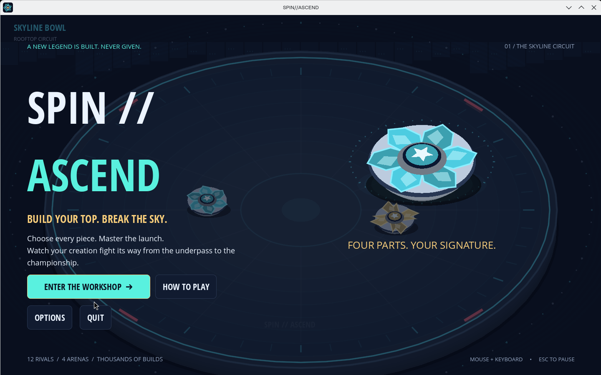
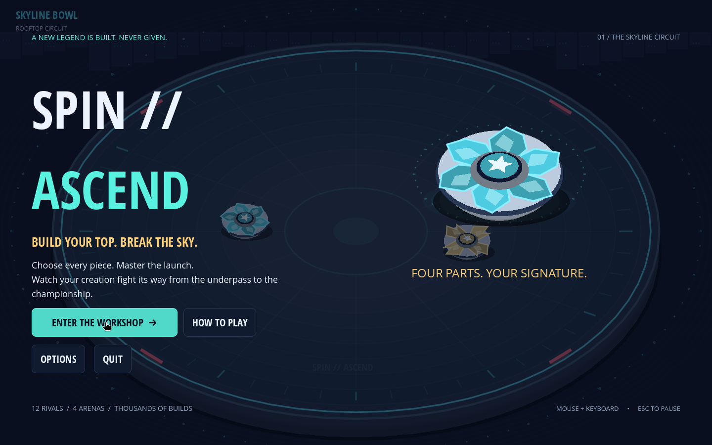
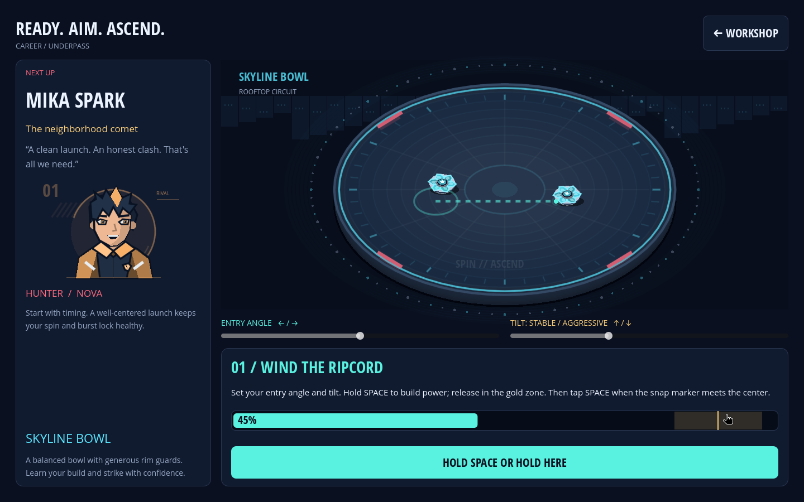
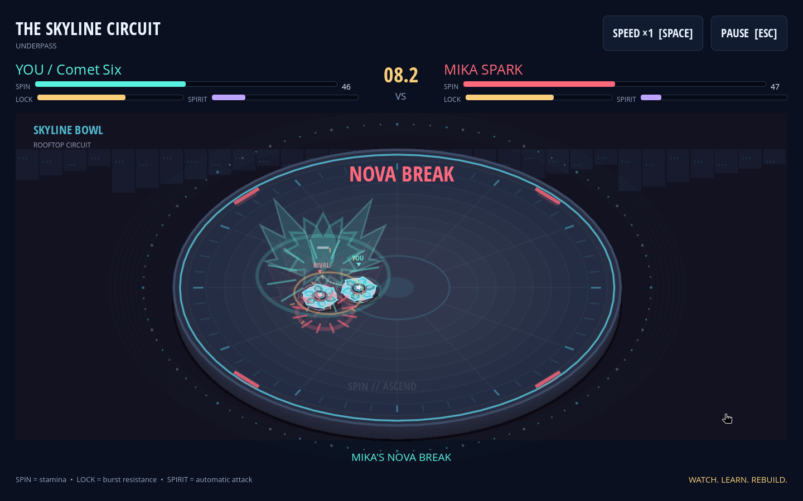

# SPIN//ASCEND

**Build your top. Break the sky.** An original, anime-inspired spinning-top career game for native Linux desktops. Build a signature top, master the ripcord launch, and let your creation fight its way from the underpass to the championship.

Download the runnable game from [GitHub Releases](https://github.com/Vaspyyy/GPT-Blade/releases). No Godot installation is needed to play. The launcher uses native Wayland in a KDE Plasma Wayland session.



```sh
tar -xzf spin-ascend-1.0.0-linux-x86_64.tar.gz
cd spin-ascend-1.0.0-linux-x86_64
./play.sh
```

Run `./play.sh --wayland` to explicitly choose Wayland. Linux x86_64, kernel 5.15+, glibc 2.28+, and OpenGL 3.3/OpenGL ES 3.0 are required. See [Linux instructions](docs/LINUX.md) for ZIP extraction, dependencies, save location, and troubleshooting.

## The game

- **36 parts / 6,400 combinations:** ten blades, eight weight discs, ten autonomous drivers, and eight spirit cores. Each part has real strengths and costs; unlocked parts offer specializations.
- **Master a two-stage launch:** wind for power, snap for precision, and adjust entry angle and tilt. Accurate launches preserve spin and strengthen the burst lock. Aggressive tilt buys force at the cost of endurance and rim safety.
- **Six telegraphed spirit attacks:** Nova's dash, Aegis's guard, Vortex's pull, Phoenix's interruptible revival, Thunder's shockwave, and Eclipse's feint. Automatic attacks create opportunities; they can miss or be countered.
- **Four arenas:** the balanced Skyline Bowl, heated Ember Crucible, slippery Glass Glacier, and pulsing Stormwell.
- **A complete twelve-rival career:** four leagues, permanent part ownership, credits, strategic rival personalities, a champion ending, and stronger legend rematches. Losing removes no money or parts.
- **An experiment-friendly workshop:** compare full-build stats, fit four starter recipes, keep three custom builds, select practice arenas, rematch defeated rivals, and read practical match lessons.
- **Original presentation:** sculpted vector tops, twelve anime-style rival portraits, layered arena effects, impact pauses, spirit silhouettes, original stereo scores, and distinct sound cues. Reduced flashes, shake control, volume, fullscreen, and local autosaves are included.

## Controls

| Screen | Keyboard / mouse |
|---|---|
| Workshop | Mouse to compare, buy, equip, and save builds. **B/C/L**: Build/Career/Lab; **1–4**: part family; **Enter**: next rival; **P**: practice. |
| Launch | **Left/right**: entry angle. **Up/down**: tilt. **Hold Space**, then release in the gold power zone. **Tap Space** when the snap marker crosses center. The large button supports the same hold/release/click sequence. |
| Battle | Battles run autonomously. **Space**: ×1/×2 speed. **Esc**: pause/resume. |
| Anywhere | **F11**: fullscreen. Visible buttons support mouse navigation. |

Start with the supplied parts. Try the Crimson Hunter, Silent Marathon, Iron Sanctuary, or Neon Slingshot in the Lab. A driver's movement path often matters more than a single high stat. Losing by spin suggests conserving stamina or applying pressure sooner; losing by burst suggests strengthening the lock; a ring-out suggests more mass, control, or a stable launch.

Your career autosaves locally, normally to `~/.local/share/godot/app_userdata/SPIN--ASCEND/career.json`, with a backup. Options include an explicit confirmed career reset. Gameplay is offline and needs no accounts.

## Development

Godot **4.6.3** with its compatibility renderer. Open `project.godot` in that editor, or run `godot --path .`. This is a native desktop project, not a web export. Python 3 is needed only to regenerate the original sound files.

```sh
godot --headless --editor --path . --import --quit
godot --headless --audio-driver Dummy --path . --script tests/test_sim.gd
godot --headless --audio-driver Dummy --path . --script tests/test_career.gd
godot --headless --audio-driver Dummy --path . --script tests/test_campaign.gd
godot --headless --audio-driver Dummy --path . --script tests/test_runtime.gd
```

On a sandboxed host without a writable home directory, set `XDG_DATA_HOME`, `XDG_CONFIG_HOME`, and `XDG_CACHE_HOME` to writable task-specific directories first. Tests use isolated profile filenames and do not overwrite the player's career.

`tools/package_linux.sh` produces the release executable, launcher, TAR.GZ, ZIP, and checksums. `tools/install_linux_templates.sh` installs checksum-verified matching Linux export templates. `tests/test_stress.gd` explores varied combinations and endgame counter-builds; `tools/check_audio.gd` validates the audio API. [Platform testing](docs/PLATFORM-TESTING.md) describes the real Wayland compositor/input harness.

[Playtest evidence and limits](docs/PLAYTESTS.md), [balance findings](docs/BALANCE.md), and [development updates](UPDATES.md) record what was observed and what should improve next.

Code, original vector art, and synthesized audio are MIT licensed. Open Sans fonts use Apache 2.0; Godot and its dependencies have the notices bundled in the Linux package.




